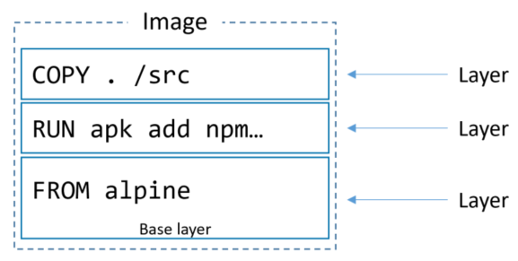

# Dockerfile

**_Instructions to build an image_**

❗️`Every string is a layer in the image.`

<center></center>

### 🔺 FROM
`Base Image` - image that we are going to use as a base for our image.

```bash
FROM <image>[:<tag>]
```

### 🔺 Workdir
`Set working Directory` - set the working directory for any RUN, CMD, ENTRYPOINT, COPY and ADD instructions that follow it in the Dockerfile.

```bash
WORKDIR <path>
```

### 🔺 Add
`Copy files from host to container` - copy files from host to container.

```bash
ADD <src> <dest>
```

### 🔺 RUN
`Run command in container` - run command in container.

```bash
RUN <command>
```

### 🔺 CMD
`Default command` - default command to run when container is started.

```bash
CMD ["executable","param1","param2"]
```

_Example Dockerfile to build an image with python and flask_

```bash
FROM ubuntu:latest
WORKDIR /app
ADD . /app
RUN apt-get update && apt-get install -y python3-pip
RUN pip3 install -r requirements.txt
CMD ["python3", "app.py"]
```
