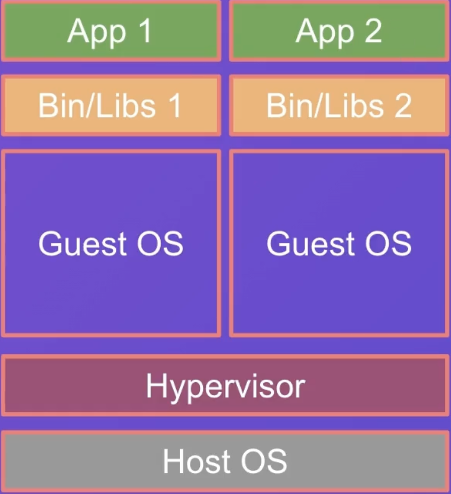
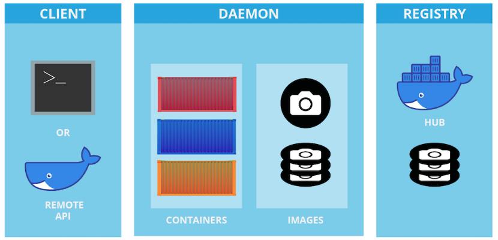

# 🔴 Docker Arhitecture
  
  
  

Docker is a client-server application with these major components: 
✔️ A server which is a type of long-running program called a daemon process (the dockerd command). 
✔️ A REST API which specifies interfaces that programs can use to talk to the daemon and instruct it what to do. 
✔️ A command line interface (CLI) client (the docker command). 

❗️Docker doesn't have kernel. Uses host kernel directly. Docker uses a technology called containerization. Containers are isolated.
## Docker container

When we run Docker container we create new namespace

**Namespace** is a feature of the Linux kernel that isolates a set of system resources from the rest of the system. 
A namespace provides a layer of abstraction between the resources of the host system and the resources of the container.  
 _The resources that can be isolated are:_

🚩 cgroups - control groups - limit, measure and control the resource usage (CPU, memory, disk I/O, network, etc.) of a collection of processes  
🚩 IPC - interprocess communication - isolate the system V IPC and POSIX message queues  
🚩 Mount - mount filesystem - isolate the mount table  
🚩 Network - network devices, stacks, ports, etc. - isolate network devices, stacks, ports, etc.  
🚩 Pid - process id - isolate the process tree  
🚩 User - user id and group id - isolate the user and group id  
🚩 UTS - unix time sharing - isolate kernel and version identifiers

## Docker Engine

Docker Engine is a client-server application with these major components:

🔹 A server which is a type of long-running program called a daemon process (the dockerd command).

🔹 A REST API which specifies interfaces that programs can use to talk to the daemon and instruct it what to do.

🔹 A command line interface (CLI) client (the docker command).

  
  
  

## Docker Daemon

The Docker daemon ( dockerd ) listens for Docker API requests and manages Docker objects such as images, containers, networks, and volumes.

A daemon can also communicate with other daemons to manage Docker services.

## Docker Client

## Docker Image

An image is an ordered collection of root filesystem changes and the corresponding execution parameters for use within a container runtime.

An image typically contains a union of layered filesystems stacked on top of each other. An image does not have state and it never changes.

## Docker Container

A container is a runtime instance of an image—what the image becomes in memory when executed (that is, an image with state, or a user process).

It runs completely isolated from the host environment by default, only accessing host files and ports if configured to do so.

## Docker Registry

A registry is a storage and content delivery system, holding named Docker images, available in different tagged versions.

The public Docker Hub and Docker Cloud are the default registries used by Docker to store official images and to distribute them.

## Docker Compose

Compose is a tool for defining and running multi-container Docker applications.

With Compose, you use a YAML file to configure your application’s services.

Then, with a single command, you create and start all the services from your configuration.
