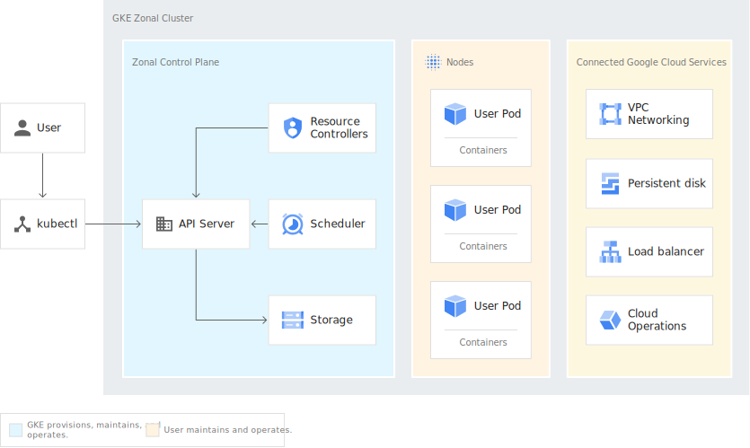

# Architecture of Kubernetes

Components of Kubernetes:

- **kube-apiserver** - The API server is a component of the Kubernetes control plane that exposes the Kubernetes API. The API server is the front end for the Kubernetes control plane. The API server is the only Kubernetes component that talks directly to the storage layer.
- **etcd** - Consistent and highly-available key value store used as Kubernetes’ backing store for all cluster data.
- **kube-scheduler** - The scheduler watches for newly created Pods with no assigned node, and selects a node for them to run on.
- **kube-controller-manager** - The controller manager is a daemon that embeds the core control loops shipped with Kubernetes. In Kubernetes, a controller is a control loop that watches the shared state of the cluster through the apiserver and makes changes attempting to move the current state towards the desired state.

Kubernetes node components:

- **kubelet** - The kubelet is the primary “node agent” that runs on each node. The kubelet takes a set of PodSpecs that are provided through various mechanisms and ensures that the containers described in those PodSpecs are running and healthy. The kubelet doesn’t manage containers which were not created by Kubernetes.
- **kube-proxy** - The kube-proxy is a network proxy that runs on each node in the cluster, implementing part of the Kubernetes Service concept.
- **Container runtime** - The container runtime is the software that is responsible for running containers.